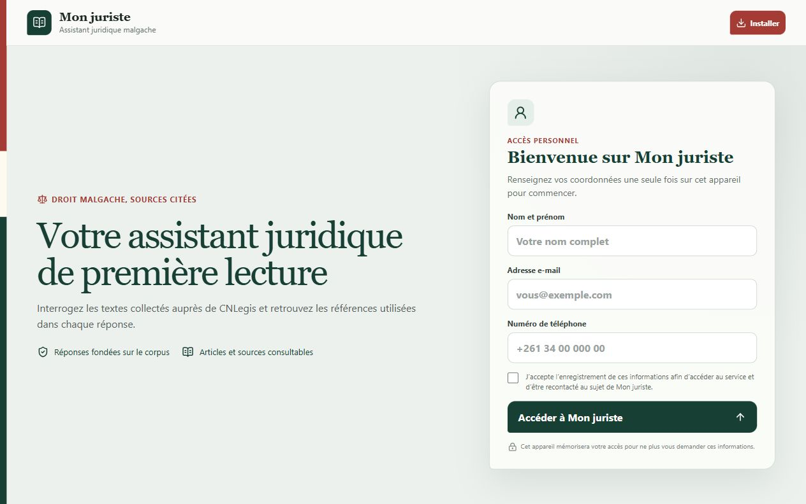
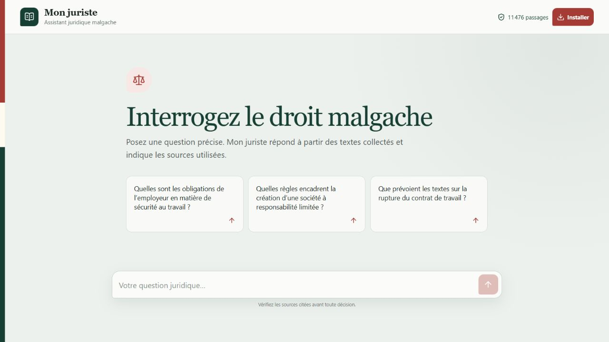
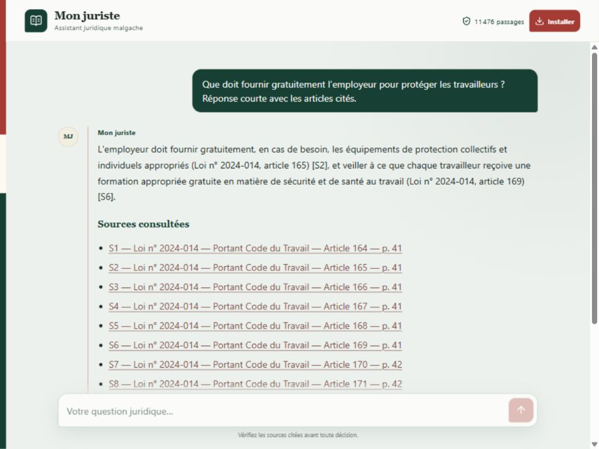
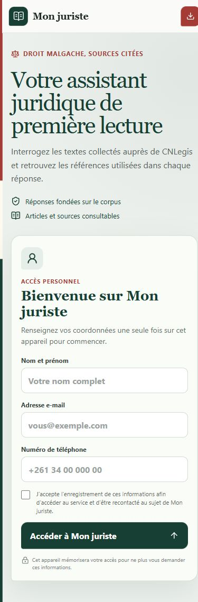
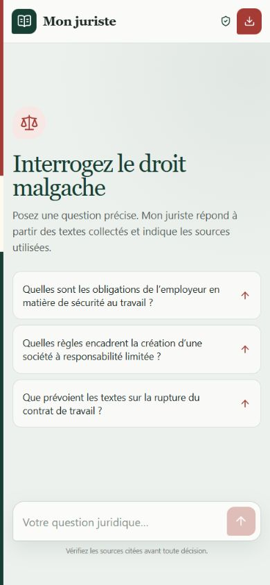
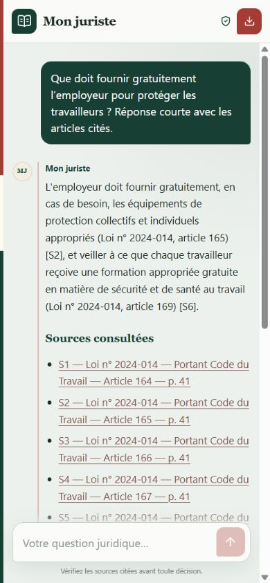

# Captures de Mon juriste

Captures réelles de l'application publique, réalisées le 6 octobre 2026. La réponse illustrée a été produite par le service avec ses références au Code du travail. Les écrans d'inscription montrent les champs vides ; la session de démonstration utilise des coordonnées fictives.

Pour une présentation sur LinkedIn, utiliser `desktop-reponse.jpg` comme aperçu principal, puis les deux vues de l'assistant sur mobile. Pour le portfolio, utiliser les images originales sans les étirer et conserver leurs proportions.

## Ordinateur

### Accueil et inscription

### Assistant juridique

### Réponse et sources

## Mobile

### Accueil et inscription

### Assistant juridique

### Réponse et sources

## Liens du projet

- Application : https://monjuris-mg.aheshman-itibar.workers.dev/
- Code source : https://github.com/iamarketings/mon-juriste-mg
